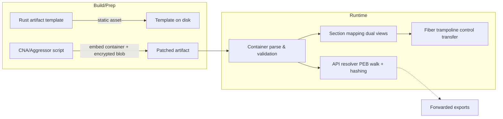
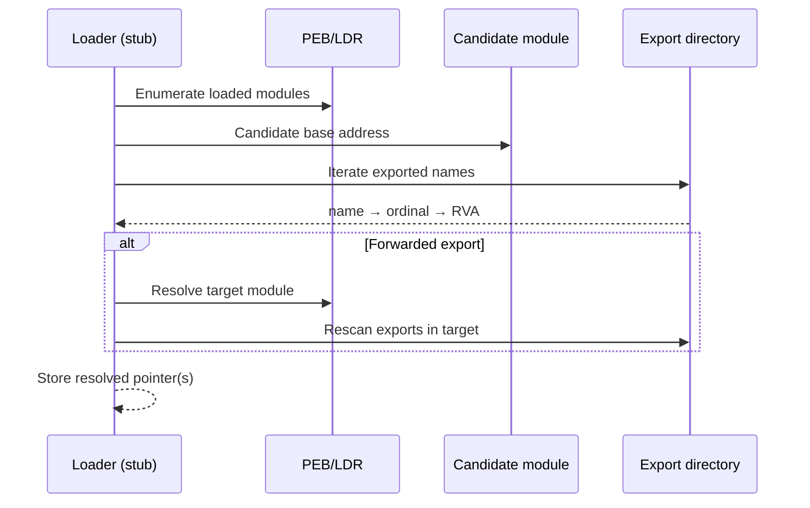
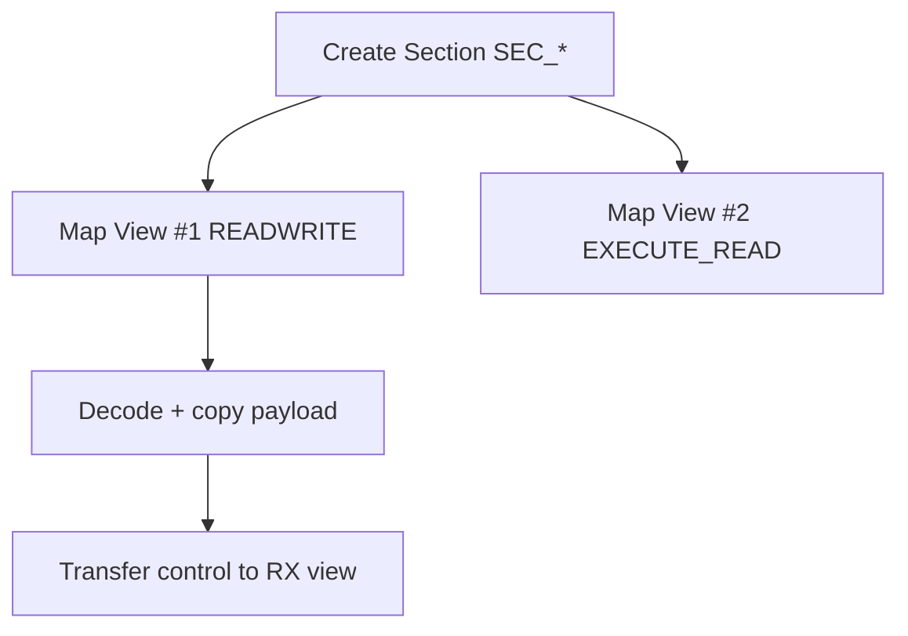
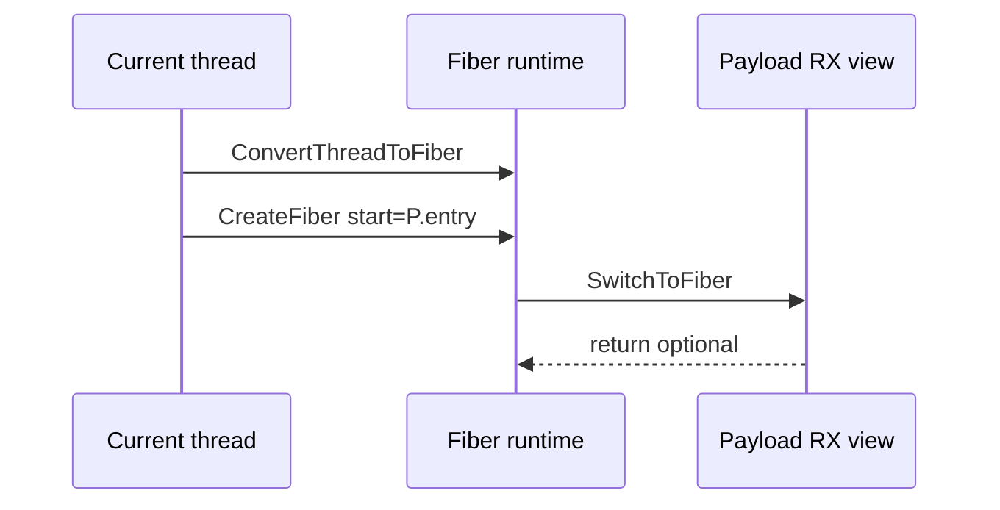

# Advanced Evasion in Rust‑Based ArtifactKit: Techniques, CobaltStrike Integration, and Defensive Analysis

> **Authorship & implementation**: This research and the accompanying template were engineered in **Rust** by our team to study how modern, memory‑safe systems languages change the detection surface of artifact loaders. We focus on design patterns, diagrams, and defender‑oriented heuristics—not operational code—to help blue teams anticipate and counter emerging techniques.

> **Ethical scope**: This article is written for blue teams, incident responders, and security researchers. It explains evasion tradecraft at a **conceptual** level to strengthen defenses. All code fragments are **non‑executable pseudocode**; there are no operational instructions or runnable artifacts.

## Abstract
We analyze a Rust‑based artifact loader architecture designed to reduce classic detection signals such as import tables, RWX permission flips, and thread‑creation artifacts. The design combines compile‑time API hashing, PEB‑based dynamic resolution, section‑object dual mapping (separate READWRITE and EXECUTE_READ views), and fiber‑based execution. We detail how a CNA/Aggressor script integrates with a Rust template through a strict marker‑and‑container contract, then provide hunting heuristics, ATT&CK mappings, a validation protocol, and measurement guidance for defenders.

---

## Executive Summary
- **Objective**: Minimize static imports, avoid RWX transitions, and replace thread creation with fibers to alter behavioral signatures.
- **Techniques**: API hashing + PEB walk; dual‑mapped section execution; fiber trampolines; marker‑based CNA patching with a compact container (header + encrypted blob).
- **Defender takeaways**: Hunt for dual mapping of the same section with different protections, fiber API usage in non‑GUI contexts, export enumeration without `LoadLibrary`, and short‑key decode loops adjacent to opaque data regions.

---

## Table of Contents
1. Architecture Overview
2. Container Structure ("Phear"‑style) — Concept
3. API Hashing & Dynamic Resolution
4. Section Mapping with Dual Views
5. Fiber‑Based Execution (Threadless Trampoline)
6. CNA / Aggressor Patching Workflow (Marker‑Based Integration)
7. Integration Rationale: Why the Contract Works
8. Optional: Direct Syscall Dispatch (Overview)
9. Detection & Hunting Playbook
10. ATT&CK Mapping (High‑Level)
11. Threat Model & Scope
12. Limitations & Trade‑offs
13. Lab Validation Protocol (Safe)
14. Benchmarking Methodology (Non‑Payload Ops)
15. Ethics, Legal, and Reproducibility Checklist
16. Appendices (Glossary, Non‑Executable Snippets)
17. Summary of Improvements

---

## 1) Architecture Overview



**Properties**
- **No static imports**: APIs are resolved at runtime by iterating loaded modules.
- **No RWX flips**: payload is written to RW view and executed from RX view of the same section.
- **No fresh thread**: fibers move execution within the current thread.

---

## 2) Container Structure ("Phear"‑style) — Concept
A compact container—written by CNA—is embedded into the template at a known marker (e.g., 1024 `A` characters). It contains a header and an encrypted payload blob.

```text
+-------------------------------+
| header (offset, length, key)  |
+-------------------------------+
| optional bootstrap hints      |
+-------------------------------+
| encrypted payload bytes …     |
+-------------------------------+
```

**Key fields**
- **offset**: Start of the embedded payload blob relative to the template.
- **length**: Size for bounds checks and decode.
- **key[8]**: Short per‑artifact key used with a rolling XOR.
- **hints (optional)**: Fast paths for resolver bootstrap.

**Defensive note**: Hunt for large opaque blobs in `.data`/custom sections that undergo decode immediately prior to non‑standard control transfers.

---

## 3) API Hashing & Dynamic Resolution

### Conceptual sequence


### Non‑executable pseudocode
```pseudo
fn hash_name(name) -> u32:
    h := SEED
    for b in bytes(name): h := (h * FACTOR) + b
    return h

fn resolve_export(module_base, wanted_hash) -> ptr:
    exp := parse_export_directory(module_base)
    for name in exp.names:
        if hash_name(name) == wanted_hash:
            return module_base + exp.rva_for(name)
    return null

fn resolve_api(wanted_hashes[]) -> map:
    apis := {}
    for mod in enumerate_loaded_modules():
        for h in wanted_hashes:
            if apis[h] is null:
                p := resolve_export(mod.base, h)
                if p is forwarded(p):
                    (tmod, tname) := parse_forwarder(p)
                    p := resolve_export(tmod.base, hash_name(tname))
                if p != null: apis[h] := p
    return apis
```

**Hunting hints**
- Export‑name scanning loops originating from non‑`ntdll` regions.
- Absence of normal library loads paired with intensive export parsing.

---

## 4) Section Mapping with Dual Views

### Concept
Create a **section object** and map it **twice**:
- **RW view** for copying decoded bytes.
- **RX view** for executing the same underlying pages; avoids `VirtualProtect`.



### Non‑executable pseudocode
```pseudo
(sec, status) := nt_create_section(size, COMMIT, EXECUTE_READWRITE)
(rw, status) := nt_map_view(sec, current_process, READWRITE)
write_bytes(rw, decrypt(payload))
(rx, status) := nt_map_view(sec, current_process, EXECUTE_READ)
jump_to(rx)
```

**Hunting hints**
- Two mappings of the **same** section with different protections in rapid succession.
- Execution from RX mapping immediately after block copy into RW mapping.
- RX views whose backing object is not a file on disk.

---

## 5) Fiber‑Based Execution (Threadless Trampoline)

### Concept
Use **fibers** to move execution within the current OS thread, avoiding `CreateThread/ResumeThread` patterns.



### Non‑executable pseudocode
```pseudo
main_fiber := fiber_convert(current_thread)
payload_fiber := fiber_create(entry=rx_entry_point)
fiber_switch(payload_fiber)
```

**Hunting hints**
- `ConvertThreadToFiber`/`CreateFiber`/`SwitchToFiber` in non‑GUI processes before non‑returning control flow.
- Lack of thread creation events paired with shellcode‑like behavior.

---

## 6) CNA / Aggressor Patching Workflow (Marker‑Based Integration)

The CNA script functions as a **structured patcher**. It transforms a static template into a per‑task artifact while preserving strict ABI contracts with the stub.

### High‑level sequence
```mermaid
sequenceDiagram
  participant TS as Team Server
  participant CNA as Script layer
  participant T as Template artifact
  participant AR as Patched artifact

  TS->>CNA: Request artifact
  CNA->>T: Read template markers present
  CNA->>CNA: Generate 8B key; encode payload
  CNA->>AR: Write container header + blob over marker
  CNA-->>TS: Return patched artifact
```

### Integration contracts
- **Marker protocol**: Template includes long runs of `A` (container slot) and optionally `M` (spawnto slot). CNA finds and replaces them. Stub reads the same regions at runtime.
- **Container layout**: Header (offset, length, key, hints) followed by encrypted payload blob.
- **Encoding symmetry**: CNA applies rolling XOR; stub reverses it.
- **Size constraints**: CNA enforces upper bounds; stub re‑checks `length`.

### Non‑executable pseudocode
```pseudo
# CNA side
key := random_bytes(8)
if has_marker_M: write_xor_spawnto(template, key)
a_pos := find_marker(template, "A" * 1024)
if payload_len > MAX: abort
blob := xor_rolling(payload, key)
header := build_header(offset=a_pos+HEADER_PAYLOAD_OFFSET, length=payload_len, key=key, hints=maybe_hints(payload))
container := header || blob
write_at(template, a_pos, container)
```

```pseudo
# Stub side
container := read_container_from_known_region()
require(0 < container.length <= MAX)
decoded := xor_rolling(container.blob[0:container.length], container.key)
resolve_apis(container.hints or fallback)
(sec, rw) := create_section_and_map_rw(container.length)
copy(decoded, rw)
rx := map_second_view_exec(sec, container.length)
fiber_switch_to(rx.entry)
```

**Hunting hints**
- Families of near‑identical binaries whose differences are concentrated in a small opaque region (per‑task random keying).

---

## 7) Integration Rationale: Why the Contract Works
- **Contract A — Markers**: The template ships with literal marker buffers (long runs of `A` and `M`) at known offsets. CNA replaces them; the stub later reads those regions.
- **Contract B — Container ABI**: The header precedes the blob and includes ordered fields (offset, length, key, hints). Both sides agree on byte order and structure size.
- **Contract C — Bounds**: A fixed maximum payload capacity is enforced by CNA and re‑checked by the stub to avoid corruption.
- **Contract D — Encoding symmetry**: CNA’s rolling XOR is inverted by the stub during parse.
- **Contract E — Optional hints**: When present, hints accelerate API resolution; otherwise, the resolver falls back to PEB/EAT parsing.

---

## 8) Optional: Direct Syscall Dispatch (Overview)
Some variants replace user‑mode APIs with **direct syscalls** to reduce exposure to user‑mode hooks. Defenders can look for:
- `syscall`/`sysenter` originating from regions not backed by `ntdll`.
- Return addresses that do not match `ntdll` thunks.

---

## 9) Detection & Hunting Playbook

### Memory‑mapping signals
- Two mappings of the **same** section object with different protections (READWRITE and EXECUTE_READ) in quick succession.
- Tight write→execute temporal correlation between RW and RX views.

### Resolver signals
- Export directory scans without preceding `LoadLibrary` events.
- Forwarder parsing patterns (string parse → second module → re‑scan).

### Execution signals
- Fiber API usage shortly before a non‑returning control transfer.
- Absence of thread creation in the same time window.

### Cross‑telemetry correlation
- ETW providers for ImageLoad, Process, Thread, and MapView operations.
- EDR memory telemetry for RX mappings not backed by files.
- YARA across memory for short‑key XOR loops near opaque blobs.

---

## 10) ATT&CK Mapping (High‑Level)

| Technique | ID | Notes |
|---|---|---|
| Signed Binary Proxy Execution (contextual) | T1218 | If templates mimic system binaries (context‑dependent). |
| Process Injection (section mapping flavor) | T1055 | Dual views (RW/RX) of one section object. |
| Thread execution obfuscation (fibers) | T1055.012 | Execution without creating a new thread. |
| Obfuscated/Compressed Files & Info | T1027 | Short‑key XOR over payload and strings. |
| Indirect Command Execution / API | T1106 | Dynamic resolution via PEB walk and export parsing. |

---

## 11) Threat Model & Scope
- **Adversary objective**: In‑memory payload execution with reduced traditional indicators.
- **Out of scope**: C2, lateral movement, privilege escalation; focus is on loader architecture.
- **Assumptions**: Host EDR with user‑mode hooks and kernel telemetry; SOC with SIEM/EDR search; isolated lab environment for validation.

---

## 12) Limitations & Trade‑offs
- Dual mapping is observable by kernel‑mode sensors and mature EDRs.
- Fiber API usage in non‑GUI contexts is unusual and can be scored.
- PEB walking and heavy export parsing can be baselined in long‑running processes.

---

## 13) Appendices

### 13.1 Glossary
- **PEB**: Process Environment Block; OS structure listing loaded modules.
- **Forwarded Export**: Export entry that redirects to another module’s export.
- **Fiber**: User‑mode cooperative scheduling primitive; runs within an existing thread.
- **Section Object**: Kernel object backing memory views mapped into one or more processes.
- **Container header**: Structured prefix describing how to parse the embedded blob.
- **Dual mapping**: Two memory views of one section with different protections.
- **Keying**: Per‑artifact small key used for obfuscation; not cryptographic security.

### 13.2 Non‑Executable Snippets (Illustrative)
```pseudo
# Rolling XOR
for i in range(0, len(payload)):
    out[i] = payload[i] XOR key[i mod len(key)]
```

```pseudo
# Marker replacement
loc := find_marker(template, MARKER)
artifact := write_bytes(template, loc, container_bytes)
```

```pseudo
# Export scanning
for each name in export_table.names:
    if hash(name) == target_hash: return address(name)
```

---
